# Bank Churn Prediction

Bank churn prediction refers to the process of analyzing and predicting the likelihood of customers leaving a bank or terminating their relationship with it. It is a crucial task for banks and financial institutions, as customer churn can have significant negative impacts on their profitability and customer base. By employing various data analysis techniques and predictive models, bank churn prediction aims to identify patterns, trends, and factors that contribute to customer attrition. This enables banks to proactively take preventive measures, such as targeted retention strategies or personalized offers, to retain valuable customers and maintain a stable customer base. The ultimate goal of bank churn prediction is to optimize customer retention efforts, enhance customer satisfaction, and improve overall business performance.

## Dataset Exploration

The dataset used for bank churn prediction contains the following features:

1. **CLIENTNUM**: Unique identifier for each customer.
2. **Attrition_Flag**: Indicates whether the customer has churned (left) or not.
3. **Customer_Age**: Age of the customer.
4. **Gender**: Gender of the customer.
5. **Dependent_count**: Number of dependents the customer has.
6. **Education_Level**: Educational background of the customer.
7. **Marital_Status**: Marital status of the customer.
8. **Income_Category**: Income category of the customer.
9. **Card_Category**: Type of credit card the customer holds.
10. **Months_on_book**: Number of months the customer has been a customer of the bank.
11. **Total_Relationship_Count**: Total number of products the customer has with the bank.
12. **Months_Inactive_12_mon**: Number of months the customer has been inactive in the last 12 months.
13. **Contacts_Count_12_mon**: Number of times the customer has been contacted in the last 12 months.
14. **Credit_Limit**: Credit limit of the customer.
15. **Total_Revolving_Bal**: Total revolving balance (outstanding debt) of the customer.
16. **Avg_Open_To_Buy**: Average open to buy (credit available) of the customer.
17. **Total_Amt_Chng_Q4_Q1**: Ratio of total transaction amount change between Q4 and Q1.
18. **Total_Trans_Amt**: Total transaction amount in the last 12 months.
19. **Total_Trans_Ct**: Total transaction count in the last 12 months.
20. **Total_Ct_Chng_Q4_Q1**: Ratio of total transaction count change between Q4 and Q1.
21. **Avg_Utilization_Ratio**: Average utilization ratio of the customer's credit limit.

These features provide valuable insights into the characteristics and behaviors of customers that may contribute to churn. Analyzing these features and building predictive models can help in understanding the factors that influence customer attrition and enable banks to take proactive measures for customer retention.

## Exploratory Data Analysis

During the exploratory data analysis, we examined the distribution of the age column using box plots and bar histograms. The analysis revealed the presence of two outliers in the age data. However, considering the small number of outliers and the fact that the age distribution follows a relatively normal pattern, it is reasonable to proceed with the dataset without removing these outliers.

The age feature exhibits a normal distribution, which aligns with our assumption of normality. This finding indicates that the age variable can be utilized as a reliable predictor in our analysis and modeling tasks.

By confirming the normality assumption for the age feature, we can proceed with further analysis and modeling with confidence in the integrity of this particular attribute.

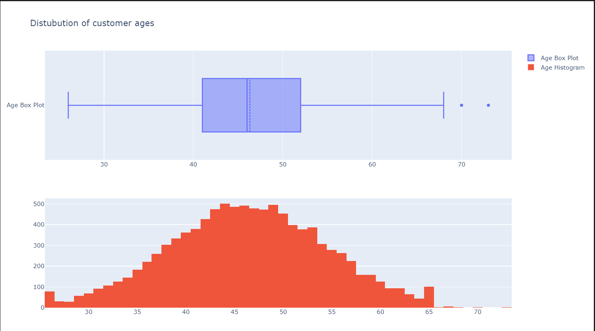

We now examine the distribution of gender and different card statuses.

Regarding gender, the analysis revealed that there are more samples of females than males in our dataset. However, the distribution of gender appears to follow a fairly normal pattern. This indicates that we can proceed with the normality assumption for the gender variable in our analysis.

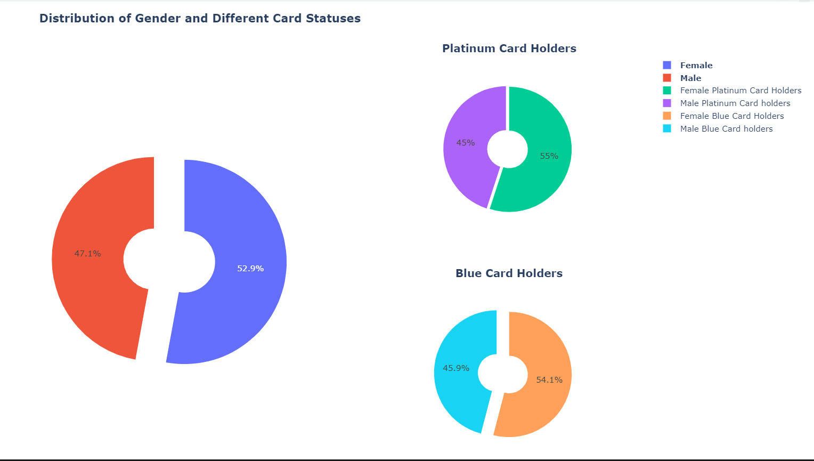

Next, we can move on to exploring the dependent count feature to gain further insights into its distribution and characteristics.

Based on the analysis of the dependent count feature, it was observed that the distribution follows a normal pattern with a slight right skew. This suggests that the assumption of normality can be reasonably applied to the dependent count variable in our analysis.
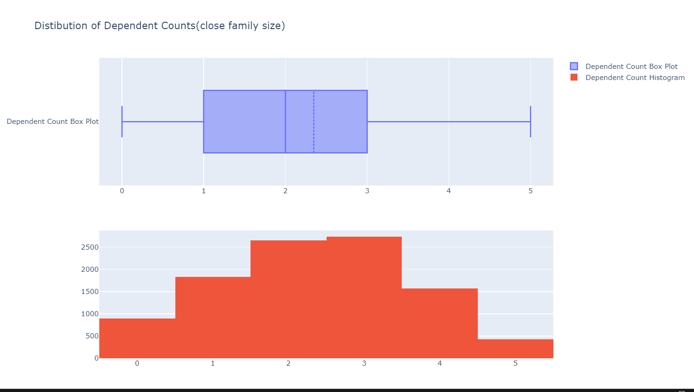

Moving forward, let's explore the proportions of different education levels within the dataset.

Based on the assumption that half of the "unknown" loan applicants have no formal education, we can estimate the proportions of different education levels within the dataset. According to your estimation, more than 70% of the dataset has some form of formal education, and about 35% have a higher level of education. This information provides insights into the educational background of the customers in the dataset.

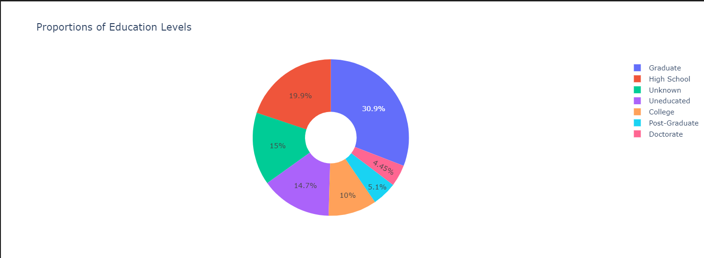

Next, let's explore the distribution of marital statuses in the dataset.

Based on the analysis of marital statuses in the dataset, it was observed that approximately half of the dataset consists of married individuals. This provides valuable information about the marital status distribution within the dataset.

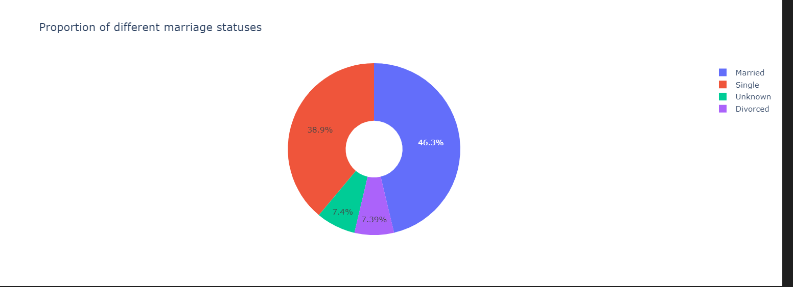

Moving on, let's explore the income levels in the dataset to gain insights into the distribution of income among the customers.

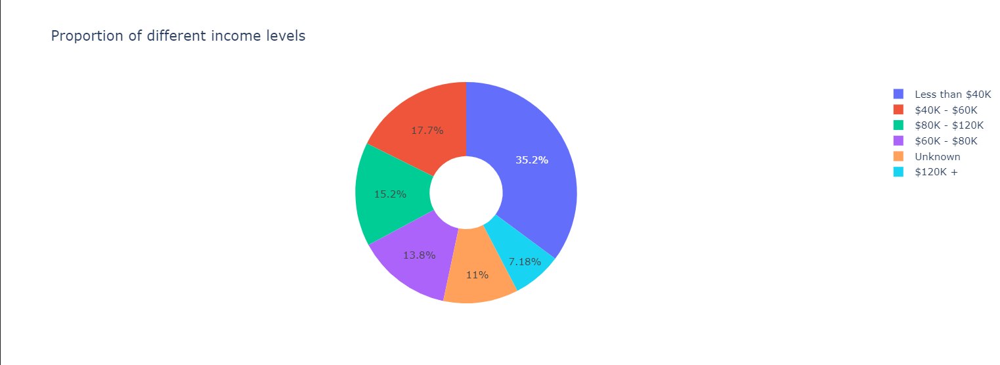

Based on the analysis of card types in the dataset, it was observed that the majority of applicants have the card type classified as "blue." This indicates that the blue card is the most prevalent type among the customers in the dataset.

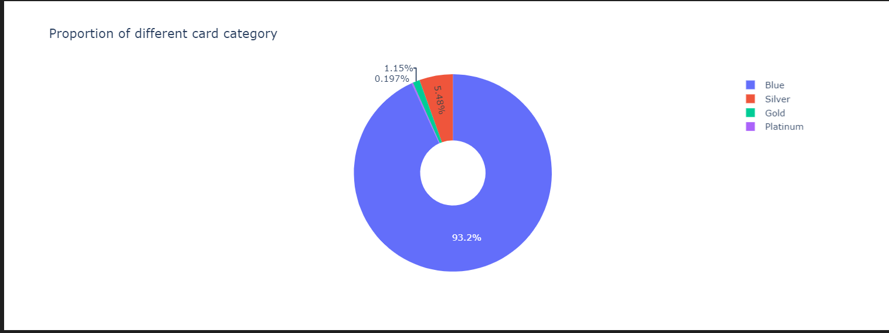

Next we visualize Months on book box plot

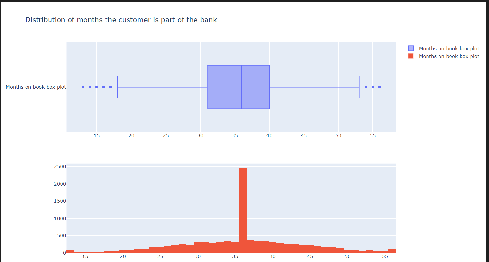

Based on the provided kurtosis value of 0.4001 for the "Months on book" feature, we can conclude that the feature does not exhibit a normal distribution. A kurtosis value close to 0 suggests that the distribution has fewer outliers or extreme values compared to a normal distribution.

This important insight indicates that we should not assume normality for the "Months on book" feature in our analysis. It is essential to consider the non-normal distribution characteristics and employ appropriate statistical techniques or models that can handle non-normal data.

Understanding the distribution of features like "Months on book" helps in making informed decisions about the selection of appropriate statistical tests or modeling approaches for further analysis.

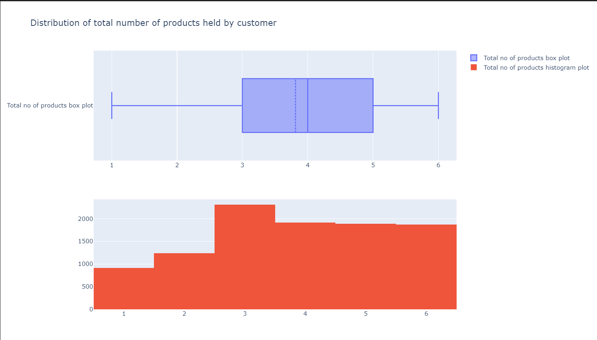

Based on the analysis, it was observed that the "Total number of products" feature exhibits a normal distribution. However, it should be noted that this feature may not be useful for churn prediction.

Moving forward, let's explore the "Number of months inactive in the last 12 months" feature to gain insights into its distribution and potential significance for churn prediction.

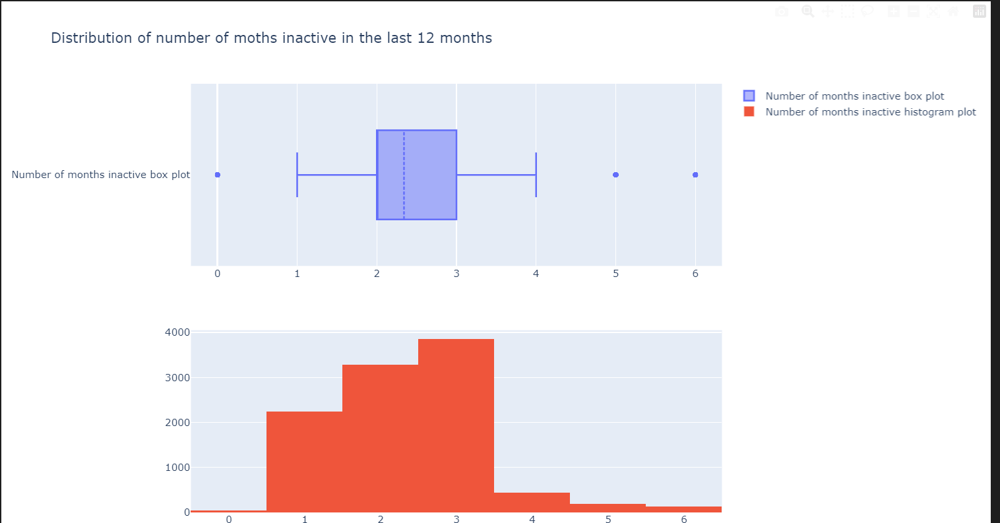

Next, we check the credit limit

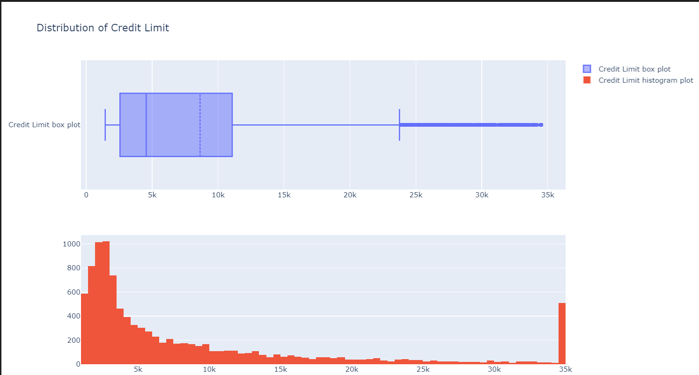

Based on the analysis, it was observed that the "Credit Limit" feature exhibits a highly right-skewed distribution. This indicates that the majority of customers in the dataset have lower credit limits, while a few customers have significantly higher credit limits.

Moving forward, let's explore the "Total Transaction Amount in the Last 12 Months" feature to gain insights into its distribution and characteristics.

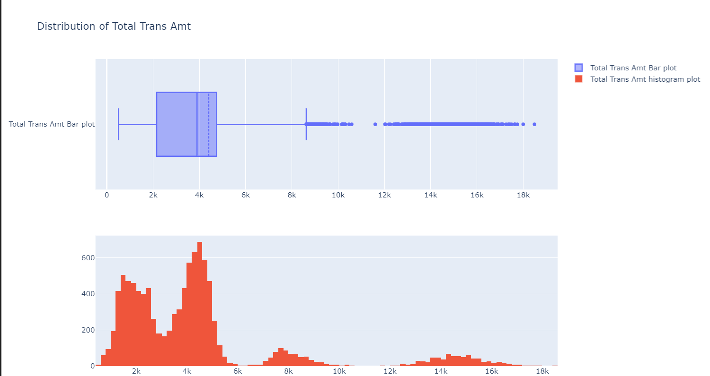

Based on the analysis, it was observed that the "Total Transaction Amount in the Last 12 Months" feature exhibits a multimodal distribution. This indicates the presence of multiple underlying groups or clusters within the data.

The insight suggests that performing clustering analysis on these groups can provide further insights and potentially uncover distinct customer segments based on their total transaction amounts. Clustering can help in identifying patterns, similarities, and differences among customers and assist in targeted marketing strategies, personalized offers, or churn prediction models.

By applying clustering algorithms to the dataset, we can explore the potential segmentation of customers based on their total transaction amounts and further analyze the characteristics and behaviors of each segment.

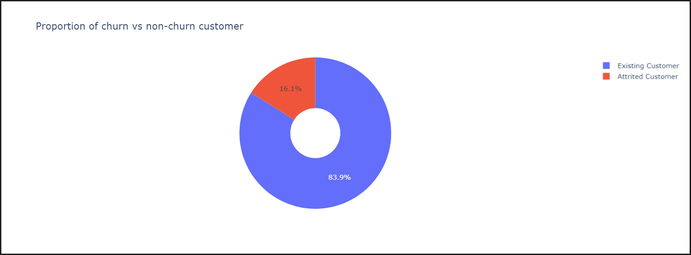

Based on the analysis, it was observed that the dataset exhibits a highly imbalanced distribution between churn and non-churn customers. This means that the proportion of churn customers is significantly lower compared to the non-churn customers.

The insight highlights the challenge of dealing with imbalanced data, as it can lead to biased models that prioritize the majority class (non-churn) and overlook the minority class (churn). To address this issue, one approach is to apply balancing techniques to the dataset.

One such technique is SMOTE (Synthetic Minority Over-sampling Technique), which generates synthetic examples of the minority class to balance the dataset. SMOTE helps in improving the representation of the minority class and can lead to better model performance and predictions for churn customers.

By applying SMOTE or other balancing techniques, we can create a more balanced dataset and ensure that the churn and non-churn classes are adequately represented, improving the effectiveness of our churn prediction models.

we divide split the data into train and test sets and apply Random forest classifier, we get an accuracy of 98% in this
Using Adaboost we get accuracy of 94.9 %.
